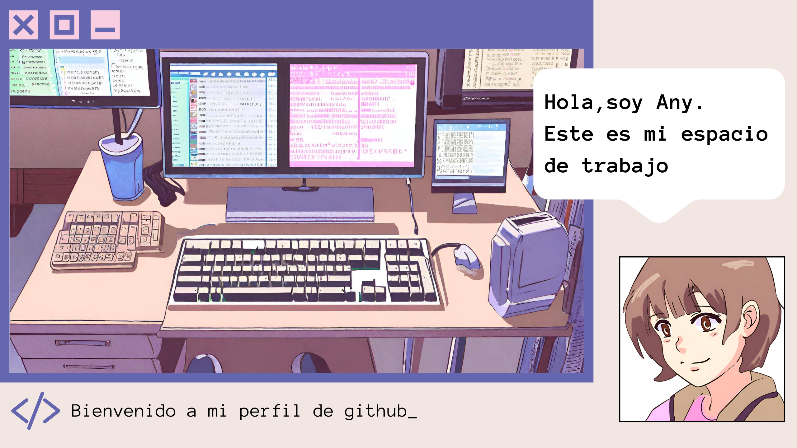

## 👋 &nbsp;Hola! Soy Ana Fontana

### &nbsp;Sobre mi

💡 &nbsp;Me considero una persona curiosa,abierta a aprender nuevos conocimientos ya sea en el area de la programacion o otra diciplina.\
🎓 &nbsp;Actualmente me encuentro aprendiendo nuevas tecnologias por un lado me estoy encaminando al area de desarrollo movil dart/flutter y por el otro estoy capacitando en el sector de la nube de AWS y sus distintos servicios.\
🤝🏻 &nbsp;Me encantaria colaborar en un proyecto grande con distintos profesionales donde se de el ambiente colaborativo y pueda plasmar mis conocimientos y habilidades.\
🌱&nbsp;Tambien estoy muy interesada en un unirme a un proyecto o voluntariado que tenga un impacto social o ecologico donde pueda con mi aporte, ayudar a esas personas a hacen la diferencia 🌎.
🎮​ &nbsp;En mi tiempo libre me gusta dedicarme hago contenido en youtube de videojuegos,lo cual disfruto hacer.Gracias a este hobby,me involucre mas con el area de la programacion,encontrar mi camino y poder decir "al fin encontre lo que queria hacer".\
✉️ &nbsp;Puede enviarme un email a fontany32@gmail.com para poder contactarme o si quieren colaborar en un proyecto.\

<h3 align="left">Languages and Tools:</h3>

                  <a href="https://www.python.org" target="_blank" rel="noreferrer"> <img
 

### 🤝🏻 &nbsp;Redes
